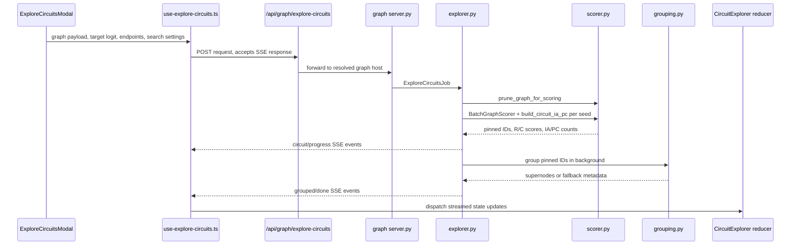

# CircuitExplorer

CircuitExplorer is an automated circuit discovery workflow built into Neuronpedia's attribution graph experience. It takes a feature-level attribution graph, proposes candidate circuits with IA+PC (Influence-Aware search plus Pathway Completion), scores them with graph-side Replacement and Completeness metrics, groups related features into semantic supernodes, and lets researchers apply, compare, and causally validate the results from the graph UI.

A short write up of it is [here](https://www.nimavaziri.com/writing/circuitexplorer-research-infrastructure-for-automated-circuit-discovery) along with a [visual walkthrough](https://www.nimavaziri.com/writing/circuitexplorer-research-infrastructure-for-automated-circuit-discovery#ui-walkthrough-before-and-after).

As Neel Nanda, Interpretability Lead at DeepMind, [describes](https://youtu.be/hdi1a9MjwDs?si=KDLHE0ajkKPT9l7v&t=4966):

> "Cynicism aside, I now feel more excited about attribution graphs. The thing that has clicked a bit more is: I think you can just get a lot of info quite fast if you put in a ton of upfront effort. I'm still not convinced it's worth the ton of upfront effort."

To which Tom McGrath, Goodfire co-founder, responds:

> "What if someone else were putting in the upfront effort?"

Assuming the transcoder quality of a desired model is sufficiently good, the goal of this project is to turn a mostly manual graph-tracing workflow into an interactive workbench: generate or load an attribution graph, open Circuit Explorer, stream ranked circuit candidates into the right panel, inspect the proposed pins and semantic groups, apply a circuit back onto the graph, then run ablation-based validation against the model.

## Table Of Contents

- [How It Is Integrated Into Neuronpedia](#how-it-is-integrated-into-neuronpedia)
- [Runtime Flow In One Pass](#runtime-flow-in-one-pass)
- [Important Folders And Files](#important-folders-and-files)
  - [Project Notes](#project-notes)
  - [Graph Page Integration](#graph-page-integration)
  - [CircuitExplorer Frontend Feature](#circuitexplorer-frontend-feature)
  - [Webapp API Proxy](#webapp-api-proxy)
  - [Graph Server](#graph-server)
  - [Evaluation](#evaluation)
- [Reviewing Scoring And Search Changes](#reviewing-scoring-and-search-changes)

## How It Is Integrated Into Neuronpedia

CircuitExplorer is not a standalone app. It is wired through the existing Neuronpedia graph page, Next.js API routes, and graph server.

For local development against Gemma-2-2B, see the [`gemma-2-2b` local runbook](../docs/gemma-2-2b-local-runbook.md). It documents the self-contained runner script, including:

```sh
scripts/gemma-2-2b-local.sh all
```

1. The user works from the graph page at `apps/webapp/app/[modelId]/graph`.
2. The graph UI opens the Circuit Explorer modal from the graph toolbar/subgraph area.
3. The modal packages the currently selected graph, target logit, endpoint nodes, and search settings.
4. The webapp calls `/api/graph/explore-circuits`.
5. The Next.js route resolves the correct graph host for the selected model/source set and proxies the request to the graph server.
6. The graph server runs pruning, IA+PC search, scoring, and optional semantic grouping.
7. Results stream back as server-sent events (`status`, `progress`, `circuit`, `grouped`, `done`).
8. The frontend stores the streamed results in CircuitExplorer state and renders them in the graph page's right panel.
9. A selected circuit can be applied back to the graph as pinned nodes plus optional supernodes.
10. Causal validation uses the existing steering/logit path to ablate either the circuit or its complement and report necessity/sufficiency-style results.

## Runtime Flow In One Pass

Frontend state starts in `features/circuit-explorer/context.tsx` and `reducer.ts`. The modal in `index.tsx` gathers search settings and delegates to `use-explore-circuits.ts`, which posts graph data to `apps/webapp/app/api/graph/explore-circuits/route.ts`.

That route uses `apps/webapp/lib/db/graph-host-source.ts` to find the correct graph server. The graph server receives the request in `server.py`, builds an `ExploreCircuitsJob`, and hands it to `explorer.py`. The explorer prunes the graph with `prune_graph_for_scoring`, creates a `BatchGraphScorer`, runs `build_circuit_ia_pc` for each seed, streams partial results back to the browser, and runs semantic grouping through `grouping.py`.

Back in the browser, streamed events update the CircuitExplorer reducer. The result panel in `index.tsx` shows ranked circuits, applies selected pins/supernodes to graph visualization state, supports circuit diffing, and calls `causal-validation.ts` when the user runs causal validation.



## Important Folders And Files

### Project Notes

- `circuit-explorer/README.md` - this overview.

### Graph Page Integration

- `apps/webapp/app/[modelId]/graph/wrapper.tsx` - wraps the graph page in `CircuitExplorerProvider`, mounts `ExploreCircuitsModal`, and adds the right-panel "Circuit Explorer" tab.
- `apps/webapp/app/[modelId]/graph/subgraph.tsx` - contains the graph-side entry point that opens Circuit Explorer from the subgraph UI.
- `apps/webapp/app/[modelId]/graph/graph-toolbar.tsx` - surrounding graph controls and toolbar context.
- `apps/webapp/app/[modelId]/graph/fidelity-dashboard.tsx` - graph-side fidelity display that complements CircuitExplorer's circuit scores.
- `apps/webapp/app/[modelId]/graph/circuit-causality-result.tsx` - renders causal validation output.
- `apps/webapp/app/[modelId]/graph/causal-validation.ts` - calls `/api/steer-logits` to compute baseline, necessity, and sufficiency measurements for pinned circuits.

### CircuitExplorer Frontend Feature

The main feature lives in:

`apps/webapp/app/[modelId]/graph/features/circuit-explorer/`

Key files:

- `index.tsx` - modal, result panel, circuit review, apply-to-graph flow, grouping retry, diff entry points, and validation button wiring.
- `use-explore-circuits.ts` - client request to `/api/graph/explore-circuits` and SSE parsing.
- `context.tsx` - React context for CircuitExplorer state/actions.
- `reducer.ts` - state transitions for exploration progress, streamed circuits, grouping, and completion.
- `types.ts` - frontend event and circuit result types.
- `graph-payload.ts` - converts the selected graph into the payload sent to the graph server.
- `diff.ts` - compares two explored circuits for shared and unique features/supernodes.
- `__tests__/` - focused tests for reducer behavior, graph payload construction, diffing, and exploration hook behavior.

### Webapp API Proxy

- `apps/webapp/app/api/graph/explore-circuits/route.ts` - resolves the graph server URL/secret for the selected model and proxies the streaming exploration response.
- `apps/webapp/app/api/graph/group-nodes/route.ts` - forwards grouping retry requests to the graph server.
- `apps/webapp/lib/db/graph-host-source.ts` - maps model/source-set choices to the correct graph host, including hosted and Runpod-backed graph servers.
- `apps/webapp/lib/env.ts` - includes graph-server environment settings such as local graph usage and secrets.

### Graph Server

- `apps/graph/neuronpedia_graph/server.py` - FastAPI routes for graph generation plus CircuitExplorer endpoints:
  - `/explore-circuits` - high-level UI exploration endpoint that coordinates multi-seed circuit search from a target logit and streams progress/results back to the browser.
  - `/group-nodes` - groups an existing set of pinned circuit nodes into semantic supernodes using the configured Anthropic model, with fallback metadata if grouping fails.
  - `/score-circuit` - scores one or more pinned-node sets against the submitted graph using `BatchGraphScorer`, returning Replacement and Completeness metrics.
  - `/build-circuit` - lower-level endpoint that builds one circuit for a given graph/cache slug and endpoint set, returning a single JSON result.
- `apps/graph/neuronpedia_graph/explorer.py` - exploration job orchestration, seed selection, graph pruning call, IA+PC loop, SSE event formatting, ranking, and background grouping.
- `apps/graph/neuronpedia_graph/scorer.py` - standalone PyTorch graph scorer, Replacement/Completeness scoring, graph pruning, batched scoring, and `build_circuit_ia_pc`.
- `apps/graph/neuronpedia_graph/grouping.py` - Anthropic-backed semantic grouping of pinned feature nodes into labeled supernodes, with fallback behavior when grouping fails.

### Evaluation

- `apps/graph/eval/eval_runner.py` - evaluation runner for benchmark-style experiments.
- `apps/graph/eval/verified-circuits/verified-circuits.json` - researcher-verified circuit data used by the evaluation workflow.
- `apps/graph/eval/README.md` - evaluation-specific documentation.

## Reviewing Order

The densest review surface is [`apps/graph/neuronpedia_graph/scorer.py`](../apps/graph/neuronpedia_graph/scorer.py). A useful review order is:

1. [`prune_graph_for_scoring`](../apps/graph/neuronpedia_graph/scorer.py#L191) - confirms which graph nodes can be removed before dense tensor scoring.
2. [`BatchGraphScorer.__init__`](../apps/graph/neuronpedia_graph/scorer.py#L256) - turns graph JSON into stable node ordering, adjacency tensors, feature/error lookups, and search ranking tensors.
3. [`_jit_score_single`](../apps/graph/neuronpedia_graph/scorer.py#L60) and [`_jit_score_batch`](../apps/graph/neuronpedia_graph/scorer.py#L123) - apply pin masks and compute Replacement/Completeness. The batch path should remain behaviorally equivalent to scoring each candidate individually.
4. [`score_fast`](../apps/graph/neuronpedia_graph/scorer.py#L478), [`score_with_suggestions`](../apps/graph/neuronpedia_graph/scorer.py#L489), and [`score_batch_masks`](../apps/graph/neuronpedia_graph/scorer.py#L543) - public scoring shapes used by endpoints and search.
5. [`build_circuit_ia_pc`](../apps/graph/neuronpedia_graph/scorer.py#L657) - influence-aware greedy selection, batched trial scoring, early stopping, and pathway completion.
6. [`explorer.py`](../apps/graph/neuronpedia_graph/explorer.py) - multi-seed orchestration, SSE events, deduping, ranking, and background grouping. Start with [`_run_exploration`](../apps/graph/neuronpedia_graph/explorer.py#L157) for the main flow and [`build_explore_circuits_response`](../apps/graph/neuronpedia_graph/explorer.py#L354) for the streaming response wrapper.

For local confidence checks, run:

```sh
env PYTHONPATH=apps/graph apps/graph/.venv/bin/python -m unittest apps.graph.tests.test_scorer apps.graph.tests.test_explorer
```

The scorer tests cover batch/individual score equivalence, unknown pins, object-style link endpoints, pruning behavior, and IA+PC feature-count accounting. The explorer tests cover SSE formatting, seed selection, streamed progress, deduping, failure handling, and completion events.

`apps/graph/tests/fixtures/scoring_golden.json` is the smallest explicit scoring contract. It pins progressively more of a tiny graph and records the expected Replacement/Completeness scores plus the expected IA+PC result. Update it only when an intentional scoring algorithm change should alter those values.
